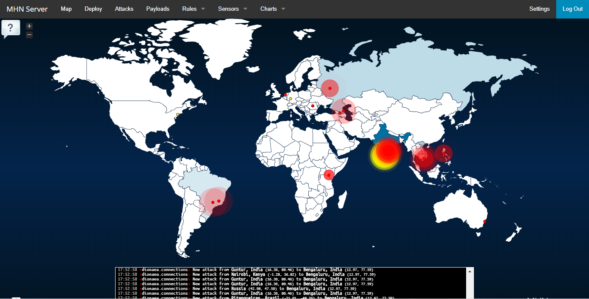

### PROYECTO RED MUNDIAL DE HONEYPOTS

WEB en Heroku:
[https://samira9.herokuapp.com/](https://samira9.herokuapp.com/)
Basada en el proyecto de Github: PEWPEW
[https://github.com/hrbrmstr/pewpew](https://github.com/hrbrmstr/pewpew) 

Presentación PREZI:
[https://prezi.com/p/dmqy552fms02/honeypots/](https://prezi.com/p/dmqy552fms02/honeypots/)

Proyecto en PDF:
[https://github.com/haustasis/honeypot_telefonica/blob/master/Honeypots_telefonica.pdf](https://github.com/haustasis/honeypot_telefonica/blob/master/Honeypots_telefonica.pdf)

Proveedor cloud: DIGITAL OCEAN
[https://www.digitalocean.com/](https://www.digitalocean.com/)

Servidor MHN: MODERN HONEYPOT NETWORK
[https://github.com/pwnlandia/mhn](https://github.com/pwnlandia/mhn)

Community Driven Honeypot: HONEYDB
[https://riskdiscovery.com/honeydb/](https://riskdiscovery.com/honeydb/)

